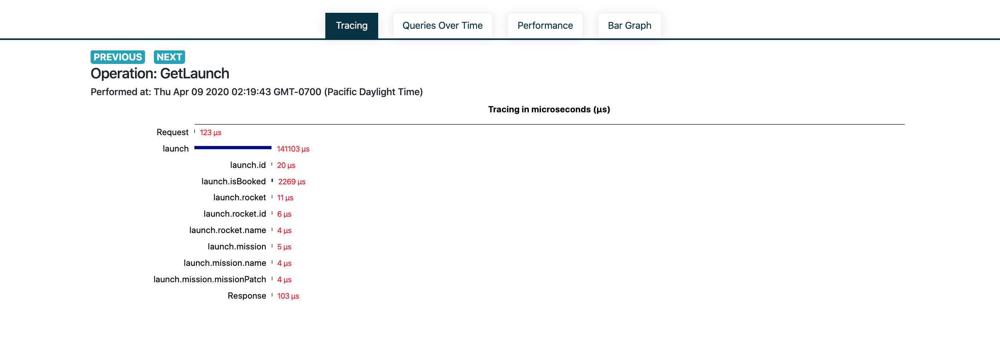
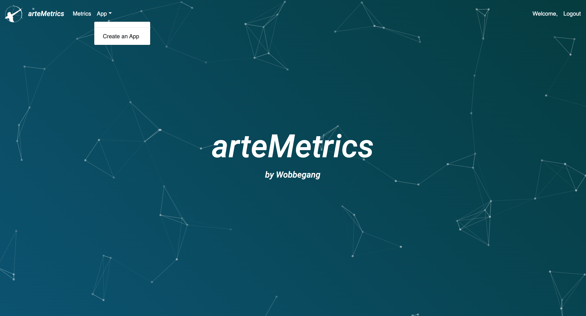
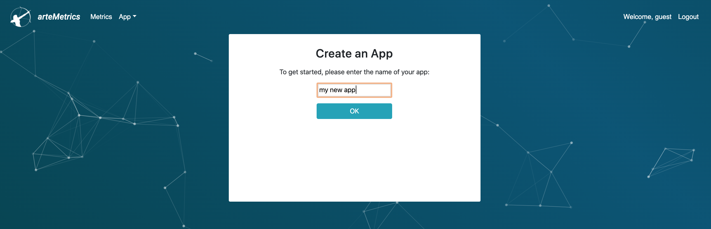
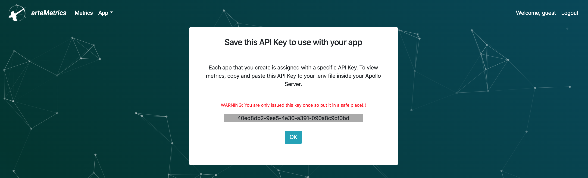

<h1 align='center'>
    
</h1>

<p align="center">
    Performance Monitoring Tool for Apollo Implementations of GraphQL
</p>

## Features

### Tracing chart for resolvers

<p align="center">
    
</p>

### Distribution bar chart

<p align="center">
    
</p>

### Line chart

<p align="center">
    
</p>

## Getting Started

To get resolver metrics for your GraphQL application, follow these easy steps.

### npm

Install the arteMetrics node module into your project

```js
npm install artemetrics
```

### Installation

Head over to [http://artemetrics.app](http://artemetrics.app) and sign up to create a new app:

<p align="center">
    
</p>
After signing up, create a new app by clicking on the App dropdown
<p align="center">
    
</p>
Once you name your new app, you will be redirected to a page containing a unique API key that you can inject into your own project
<p align="center">
    
</p>

After copying the API key to your clipboard, paste it into a .env file

```js
API_KEY = '45ed4db2-9ee5-4e30-a391-090a2c9cf0mg';
```

In your server file, require in our node module:

```js
const arteMetrics = require('artemetrics');
```

And pass in your process.env.API_KEY into arteMetrics:

```js
arteMetrics.setApiKey(process.env.API_KEY);
```

Then when you create an instance of ApolloServer, pass in a couple keys to the ApolloServer constructor:

```js
const server = new ApolloServer({
  typeDefs,
  resolvers,
  rootValue: (query) => {
    arteMetrics.getName(query);
  },
  formatResponse: (response) => {
    arteMetrics.process(response);
  }
});
```

And then spin up your server

```js
server.listen({ port: process.env.PORT || 4000 }).then(({ url }) => {
  console.log(`🚀 app running at ${url}`);
});
```

And now if you head over to [http://artemetrics.app](http://artemetrics.app) and select your app, you should be able to see the queries you made through your application and track the duration of your resolvers

## License

Distributed under the MIT License.
[MIT](LICENSE)

## Contributing

The team at arteMetrics would love contributions to this application! If there is something you would like to add, fork and clone this repo and make a PR!

## People

[Sean Arseneault](https://github.com/itsmesean),
[Brian Chiang](https://github.com/ch-brian),
[Noah King](https://github.com/code-ark),
[Joseph Renolayan](https://github.com/jodaisu),

[npm-image]: **
[npm-url]: https://www.npmjs.com/package/artemetrics
[downloads-image]: **
[downloads-url]: https://npmjs.org/package/artemetrics
